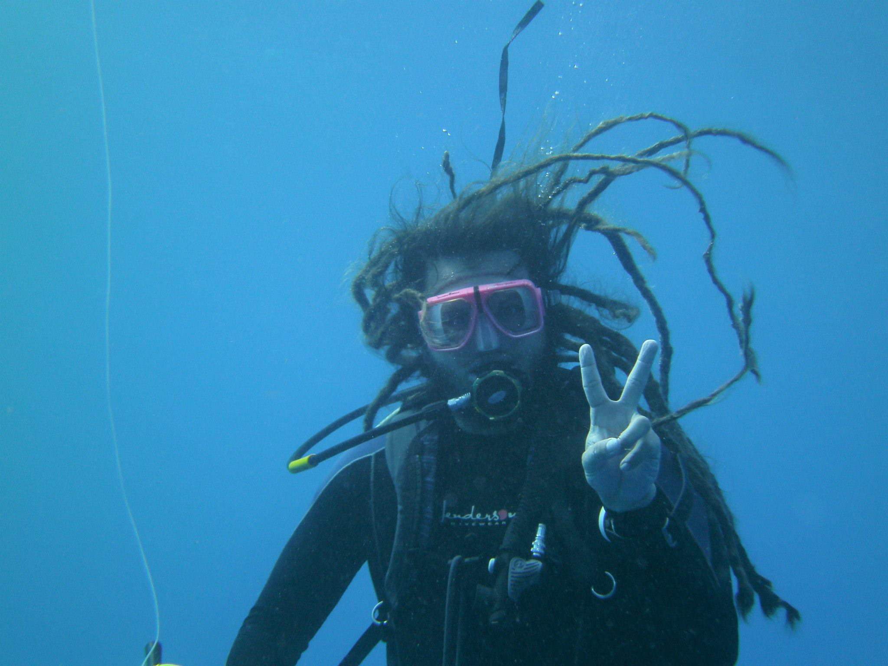

<!--hello, this is an html comment--> 
<!--the title here NORMALLY controls the big text at the top of this web page as well as the title shown within the tab but I changed that so this title only controls the text within the tab for all .Rmds/.htmls (the change is coded within the in_header.html) because I wanted the information in the tab to say something different than the text at the top of each web page--> 
<br>
<!-- anything within carrots is html code that will by knitted into the .html output my knitting the .rmd-->
<!-- br means break and inserts an empty line, i think the size of the break is based on the default size of the body text-->

# About Me
<!-- header 1, aka the large font that is centered at the top of the web page, best to leave a line between headers and other code, otherwise sometimes rmd won't format them correctly -->


<!--the code below indicates this is a code block containing code (within the ```) in the language css and we don't want this code to be echoed onto the website (echo=F)-->
<!--note: no comments can be made within the code block bc rmd is weird so all comments will be below the block and will occur below a comment out version of the thing excatly as it appears within the block,--> 
<!-- ```{css, echo=FALSE}
<!-- img { -->
<!--     width:  400px; -->
<!--     height: 400px; -->
<!--     padding: 10px; -->
<!--     object-fit: cover; -->
<!-- } -->
<!-- in this css code block the images called within the rest of this web page (with the html tag "img") are formatted to all be the same size (height:400px; and width:400px; means a square with a height and width of 400 pixels each) with 10 pixels of padding around it (padding: 10px; keeps from the text being too close to it)
object-fit: cover; defines how the actual image fits within the image container that is made by the height, width and padding commands above), this ensures that if the raw image is bigger or smaller than the set height and width, it will be resized to take up all available space while maintaining the right aspect ratio, if you don't like how one of the images looks here DO NOT CHANGE THIS instead crop the image differently -->
<!-- removing the above code from working bc I want to add in twitter images, this formatting will now be in each image itself instead of above-->


<!-- this is html that calls the container "img" (styled above in css) and fills it with the image linked within the src="path/to/img/from/rproj/dir"
align="left" aligns this image to the LEFT of the screen 
height=400px and width=400px means a square with a height and width of 400 pixels each
style = everything that follows after this is css code 
"padding: 10px; gives 10 pixels of padding around it the image 
object-fit: cover;" defines how the actual image fits within the image container that is made by the height, width and padding commands above), this ensures that if the raw image is bigger or smaller than the set height and width, it will be resized to take up all available space while maintaining the right aspect ratio, if you don't like how one of the images looks here DO NOT CHANGE THIS instead crop the image differently-->

<!-- <br> -->
<!-- for each person, I currently have set the image (see above) then one break (this line) then their name as a h4 (see below)-->


<!-- 4 hastags mean this is a header of size h4, the fourth biggest (size set in style.css), this size is currently consistent for all people's names within this page-->

<!-- 6 hastags mean this is a header of size h6, the fourth biggest (size set in style.css)-->

Jason earned his BS in Biology from [Northeastern University](https://www.northeastern.edu/). He then worked as a research assistant at the [Cape Eleuthera Institute](http://www.ceibahamas.org/) performing research on the effects of invasive lionfish on native fish communities. He started working with Dr. [Derek Hogan](https://derekhoganresearch.wordpress.com/) at [TAMUCC](https://tamucc.edu/) for his MS. Initially he planned to study if lionfish act as a strong selective pressure on native fishes. However, after what, in restrospect, was a fortunate series of events he transitioned to researching [family groupings in <i>Coryphopterus personatus</i>](https://doi.org/10.1371/journal.pone.0153381). Realizing the abundance and presence of relatives in the same area makes for an interesting study species to look at dispersal and how the environment influences dispersal Jason decided to continue working with Derek at TAMUCC for his PhD to look into these questions. 
<!-- body text about the person (size set in style.css)-->
<br><br>
jdselwyn(at)gmail(dot)com
<br>
<a target="_blank" title="follow me on Twitter" href="https://www.twitter.com/jasonselwyn"></a> [JasonSelwyn](https://www.twitter.com/jasonselwyn)

<br>

<!-- after each person I have inserted two separated breaks (takes up more space than 2 together... not sure why) and then the *** which draws a line -->

***
