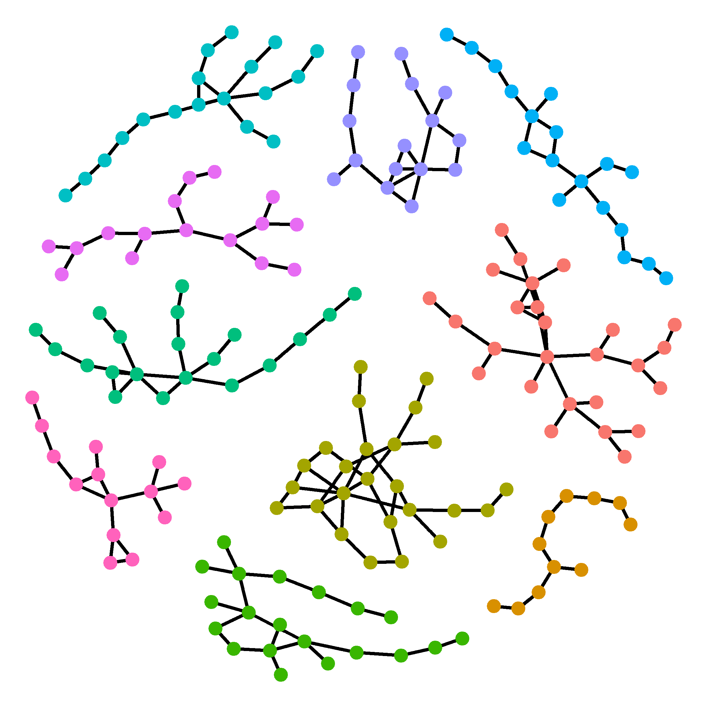

<!--hello, this is an html comment--> 
<!--the title here NORMALLY controls the big text at the top of this web page as well as the title shown within the tab but I changed that so this title only controls the text within the tab for all .Rmds/.htmls (the change is coded within the in_header.html) because I wanted the information in the tab to say something different than the text at the top of each web page--> 
<br>
<!-- anything within carrots is html code that will by knitted into the .html output my knitting the .rmd-->
<!-- br means break and inserts an empty line, i think the size of the break is based on the default size of the body text-->


<!--the code below indicates this is a code block containing code (within the ```) in the language css and we don't want this code to be echoed onto the website (echo=F)-->
<!--note: no comments can be made within the code block bc rmd is weird so all comments will be below the block and will occur below a comment out version of the thing exactly as it appears within the block,--> 
```{css, echo=FALSE}
caption {
  display: table-caption;
  text-align: left;
  font-size: 14px;
  padding: 10px;
  color: black;
}

@media screen and (max-width: 480px) {
  table{
    width: 100%;
    position: center;
  }
  img{
    align: center;
  }
}
```
<!-- caption { -->
<!--   display: table-caption; -->
<!--   text-align: left; -->
<!--   font-size: 14px; -->
<!--   padding: 10px; -->
<!-- } -->

<!-- the caption object formatted above (still in the language css) sets the style for the "captions" aka the image+caption pairs within this webpage
display: table-caption; sets the display of any object called with the tag "caption" to be a table and a caption (the table is where we will insert the image)
text-align: left; left aligns the text within any caption
font-size: 14px; sets the font of the text within the image captions
left: 0 means the body will start 0 pixels from the left of the screen (again regardless of width or other things contained withing this page as discussed above)
padding: 10px; sets the padding to be 10px around the entire caption object (the text AND the image) -->


<!-- @media screen and (max-width: 480px) { -->
<!--   table{ -->
<!--     width: 100%; -->
<!--     position: center; -->
<!--   } -->
<!-- } -->

<!-- the table object formatted above (still in the language css) sets the style for the "table" aka the image+caption pairs within this web page when the web page is smaller than 480 pixels (aka a phone or ipad screen)
width: 100%; sets the entire object (image+caption) to take up 100% of the screen, ensures that the texts isn't weirdly wrapping these images
position: center; centers the entire object (image+caption) on the screen, BUT doesn't center the image contained within the table itself.... a problem that I am currently working on -->


# Research
<!-- header 1, aka the large font that is centered at the top of the web page, best to leave a line between headers and other code, otherwise sometimes rmd won't format them correctly -->

<br>

### **How is Dispersal Influenced by the Local Environment**

<table class="image" align="right">
<caption align="bottom">Habitat Quality (top) and Heterogeneity (bottom) influencing Dispersal.</caption>
<tr><td></td></tr>
</table>

The main focus of my dissertation is to understand how the local habitat influences dispersal dynamics. I am using <i>Coryphopterus hyalinus</i>/<i>personatus</i> as a model system to understand these dynamics because, despite being generally poorly studied these two species contain characteristics making them an ideal study system for these questions. Namely, an abundant, short-lived sedentary adult life-history combined with generally localized dispersal behaviour.

<br><br><br>


***

### **What are the evolutionary impacts of living near close relatives?**

<!-- body text about the general research of the lab (size set in style.css), the * * around a word make the word italicized-->
<br><br><br>
<table class="image" align="right">
<caption align="bottom">Family Networks of <i>C. hyalinus</i>.</caption>
<tr><td></td></tr>
</table>

<!-- <table class="image" align="right"> -->
<!-- inserts a table of class image and aligns that table to the right (formatting corresponds to the table tag set in css above, although currently only set for when the screen size is small)-->

<!-- <caption align="bottom">Top picture: *P. neomexicanus*, bee syndrome. Bottom pucture: *P. barbatus*, hummingbird syndrome.</caption> -->
<!-- inserts a caption that is attached to the table inserted above (as styled by the caption tag set in css above) and aligns that caption to the bottom of the table (aka image) (the ** around a word still make the word italicized)
the </caption> tells html that is where the caption ends -->

<!-- <tr><td></td></tr> -->
<!-- the tr tag means this line represents a row in the table and the td tag means this is a "daughter cell" of the table, basically these tags just say in html that this image is meant to be inserted into the table
the 
<!--  this tells the html that this is where the table object, (opened at the start with "<table" ends) -->

One of the instigating findings leading me to use <i>Coryphopterus</i> as a study system to understand dispersal processes is finding in my [MS work](https://doi.org/10.1371/journal.pone.0153381) that there are many close relatives living much closer together than was previously anticipated. This finding has also led to another research interest of mine, what are the consequences of living with close relatives, good and bad?

<br><br><br>

<!-- for each topic, I currently have set the image+caption (see above) then three breaks (this line) then a line (below) and then the next topic-->

***

### **What is "good quality" habitat from the perspective of <i>Coryphopterus hyalinus</i>/<i>personatus</i>?**
<!--h3 header, 3rd biggest, size set in style.css, this is bolded as indicated by the ** ** around the words -->

<table class="image" align="left">
<caption align="bottom">3D Model Belizean Reef</caption>
<tr><td></td></tr>
</table>

<!-- image +caption being set as discussed above -->

Part of understanding how habitat quality influences dispersal is to first understand what counts as "good" habitat from the perspective of the <i>Coryphopterus</i> themselves. To try and get a fish eye view of what makes a particular part of the coral reef a better/worse place for a <i>Coryphopterus</i> to live I used structure-from-motion photogrammetry to create 3D reef models which I then used to model the distribution of <i>Coryphopterus</i> on the reef.

<br><br><br><br>

***

### **How do <i>Coryphopterus hyalinus</i> and <i>C. personatus</i> maintain species boundaries despite living together?**

<i>Coryphopterus hyalinus</i> and <i>C. personatus</i> both look remarkably similar and they both live spread throughout the Caribbean with nearly entirely overlapping depth distributions and are seemingly the same ecologically. So, why are they two separate species? Do they hybridize much? Initially, I hypothesized that in areas of distributional overlap they would live in distinct shoals spread across the reef, so while at a macro-scale they were overlapping, and a micro-scale they were actually spatially isolated. This turns out not to be the case (in review in Marine Biology). However, despite living on top of each other we find very little evidence of wide-spread hybridization. So what is the mechanism maintaining this species boundary, and what does that teach us about speciation?

<table class="image" align="center">
<caption align="bottom"></caption>
<tr><td></td></tr>
</table>
 
***

